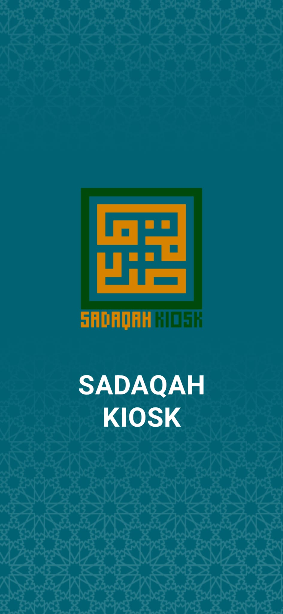
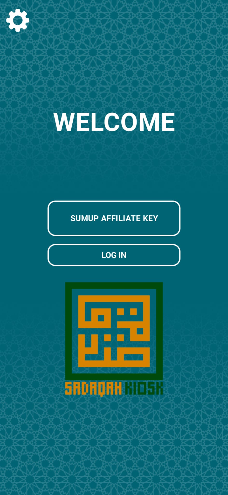
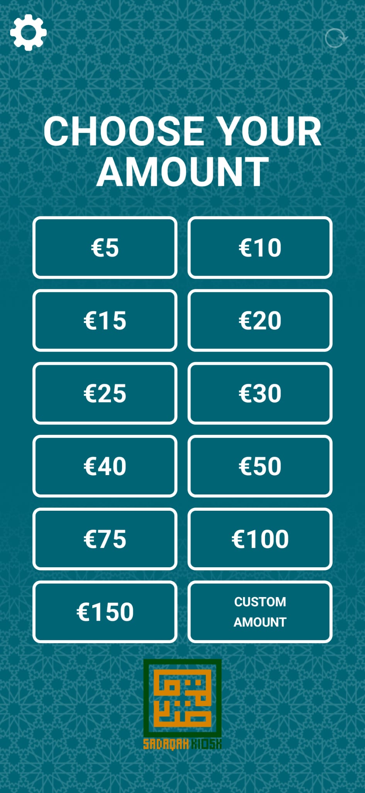
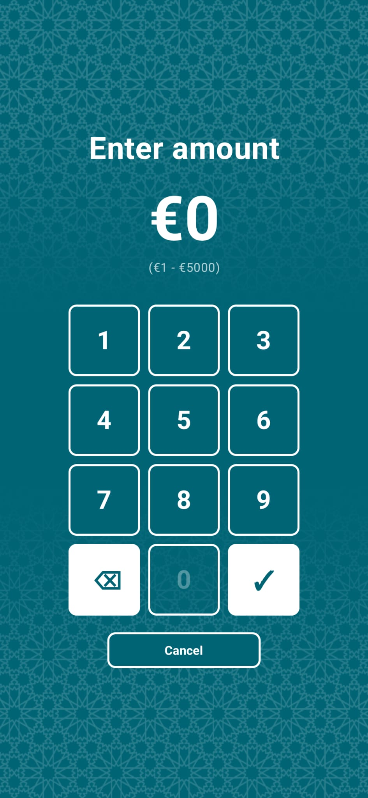
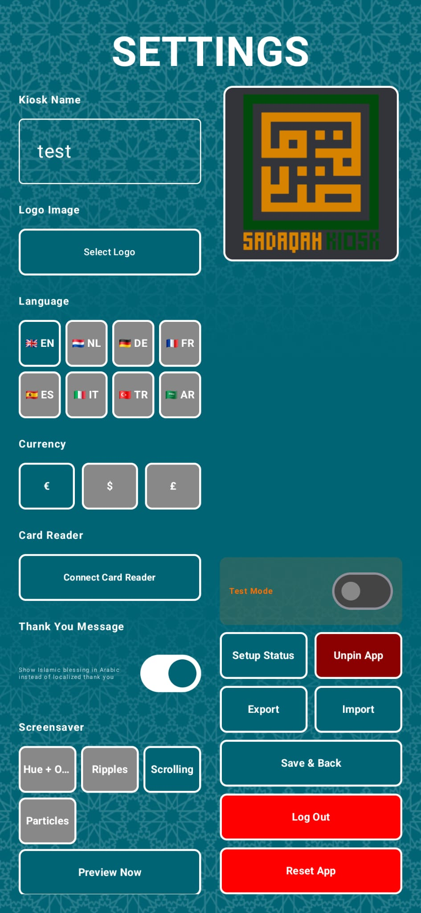

# Sadaqah Kiosk

An open-source Android donation kiosk app powered by the [SumUp](https://sumup.com) card payment SDK. Designed for mosques, Islamic charities, and community organisations to accept card donations through a self-service touchscreen terminal.

[](LICENSE.md)

---

## Screenshots

<p align="center">
  
  
  
  
  
</p>

---

## Features

- **Card payments** via SumUp card reader (chip & PIN, contactless)
  - Achieved through the SumUp Android SDK: https://github.com/sumup/sumup-android-sdk
- **Preset donation amounts** on a responsive grid
- **Custom amount** entry via on-screen numpad
- **8 languages**: English, Dutch, German, French, Spanish, Italian, Turkish, Arabic
  - Auto-detected from device locale on first launch
- **Fully themeable**: background, pattern overlay, button color, and text/border color
- **Logo upload**: display your organisation's logo on the donation screen
- **Islamic thank-you screen**: toggle between an Arabic blessing (بارك الله فيكم) and a localised "thank you"
- **Biometric / PIN gate** on the settings screen
- **Export / import settings** as JSON (including affiliate key, with permission)
- **Offline awareness**: warns when internet is unavailable; auto-dismisses SumUp login screen on disconnect and auto-reinitialises after prolonged outage
- **Auto-recovery**: automatic app restart on repeated card reader or reinit failures, with cooldown and max-restart guard to prevent loops
- **Auto-start on boot**: launches automatically when the device powers on
- **Device owner / kiosk mode**: optional silent lock-task mode (no blue notification bar) when set as device owner
- **Screensaver** after configurable idle timeout
- **Auto-reinitialise** at 02:00 daily to keep the SumUp session fresh
- Responsive layout — tuned for Lenovo M9 tablet (800 dp portrait), scales to any Android device

---

## Requirements

| Requirement         | Details                                         |
|---------------------|-------------------------------------------------|
| Android             | 11.0+ (API 30)                                  |
| SumUp account       | [sumup.com](https://sumup.com) free to register |
| SumUp Affiliate Key | Generated in the SumUp developer dashboard      |
| SumUp card reader   | Air, Air Lite, Solo, or any supported reader    |
| Internet connection | Required for SumUp authentication and payments  |

---

## Building from Source

### Prerequisites

- Android Studio Hedgehog or newer
- JDK 11+
- Android SDK with API 35

### Steps

```bash
git clone https://github.com/HiIAmMoot/SadaqahKiosk.git
cd SadaqahKiosk
```

Open the project in Android Studio, or build from the command line:

```bash
# Debug build
./gradlew assembleDebug

# Release build (requires a signing keystore — see Signing below)
./gradlew assembleRelease
```

The debug APK is output to `app/build/outputs/apk/debug/`.

### Signing a Release Build

1. Generate a keystore:
   ```bash
   keytool -genkey -v -keystore kiosk.jks -keyalg RSA -keysize 2048 -validity 10000 -alias kiosk
   ```
2. Create `keystore.properties` in the project root (this file is gitignored):
   ```properties
   storeFile=../kiosk.jks
   storePassword=your_store_password
   keyAlias=kiosk
   keyPassword=your_key_password
   ```
3. Reference it in `app/build.gradle.kts` under `signingConfigs`.

---

## First-Time Setup

1. Install the APK on your Android tablet or phone.
2. Launch the app, it auto-detects your device language. 
3. Tap the **gear icon**, biometrics (fingerprint or PIN) will trigger automatically.
4. In Settings, customize the kiosk name, logo, colors, currency, and language. Tap Save & Back.
5. Log in with your SumUp Affiliate Key, you will then be prompted to log in using your SumUp account's credentials.
6. You will be prompted to connect a device.
7. After successful connection, your donors can now tap to give.

### Device Owner Setup (Optional)

Setting the app as device owner enables silent lock-task mode (no blue "app is pinned" notification) and allows programmatic Bluetooth control. The app works fine without it — this is optional for a more polished kiosk experience.

> **Important:** Device owner can only be set on a device with no accounts added, or via a fresh factory reset. You cannot set device owner on a device that already has a Google account signed in.

1. Enable **Developer Options** and **USB Debugging** on the tablet.
2. Connect the tablet to a computer with ADB installed.
3. If accounts are present, remove them or factory reset:
   ```bash
   adb shell pm list users
   ```
4. Set device owner:
   ```bash
   adb shell dpm set-device-owner com.sadaqah.kiosk/.KioskDeviceAdminReceiver
   ```
5. Verify it worked:
   ```bash
   adb shell dpm list-owners
   ```
   You should see `com.sadaqah.kiosk/.KioskDeviceAdminReceiver`.

To remove device owner later:
```bash
adb shell dpm remove-active-admin com.sadaqah.kiosk/.KioskDeviceAdminReceiver
```

### Settings Reference

| Setting                                     | Description                                                  |
|---------------------------------------------|--------------------------------------------------------------|
| Kiosk Name                                  | Appears on SumUp transaction receipts with a "SK - " prefix  |
| Logo                                        | PNG/JPEG shown on the donation screen, transparency supported |
| Language                                    | UI language; 8 options; auto-detected on first launch        |
| Currency                                    | EUR, USD, or GBP                                             |
| Background / Pattern / Button / Text colors | Full RGBA color picker with history and suggested colors     |
| Connect Card Reader                         | Pairs the SumUp reader (must be logged in first)             |
| Islamic Blessing when donating              | Toggle between Arabic بارك الله فيكم and localised "thank you" |
| Export / Import Settings                    | Back up or copy settings between devices as JSON             |
| Reset App                                   | Clears all stored data and restarts (double-tap to confirm)  |

---

## Architecture

```
app/src/main/java/com/sadaqah/kiosk/
├── MainActivity.kt              # Activity, SumUp API integration, state management
├── Translations.kt              # Language enum, TranslationManager, all 8 Strings objects
├── ColorHistory.kt              # Recently picked and suggested colors singleton
├── Utils.kt                     # responsiveDp / responsiveSp helpers, grid column logic
├── BootReceiver.kt              # Launches app on BOOT_COMPLETED
├── KioskDeviceAdminReceiver.kt  # Device admin receiver for silent lock-task mode
├── model/
│   └── Settings.kt              # Data class for all persisted settings
├── recovery/
│   ├── KeyValueStore.kt         # SharedPreferences abstraction (testable)
│   ├── RestartManager.kt        # Auto-restart decision logic with guards
│   └── NetworkRecoveryManager.kt # Network outage detection and recovery
├── screens/
│   ├── DonationScreen.kt        # Main donation grid
│   ├── CustomAmountScreen.kt
│   ├── SettingsScreen.kt
│   ├── SetupStatusScreen.kt     # Network/Bluetooth/reader status checklist
│   ├── ColorPickerScreen.kt
│   ├── LoginScreen.kt
│   ├── ScreensaverScreen.kt
│   ├── ThankYouScreen.kt
│   └── MaintenanceScreen.kt
└── components/
    ├── NumpadButton.kt
    └── ColorComponents.kt
```

Settings are persisted to `SharedPreferences` as JSON (Gson). The SumUp SDK handles all payment processing; this app never touches card data.

---

## Contributing

Contributions are welcome! Please read the guidelines below before opening a PR.

### Reporting Bugs

Use the [Bug Report](.github/ISSUE_TEMPLATE/bug_report.md) template. Include:
- Device model and Android version
- Steps to reproduce
- What you expected vs. what happened
- Logs if available (`adb logcat -s SumUpPayment SumUpLogin NetworkStatus`)

For bugs specifically related to the SumUp SDK, please refer to their github issues page: https://github.com/sumup/sumup-android-sdk/issues

### Suggesting Features

Use the [Feature Request](.github/ISSUE_TEMPLATE/feature_request.md) template.

### Submitting Code

1. Fork the repository and create a branch from `master`:
   ```bash
   git checkout -b feature/my-feature
   ```
2. Make your changes. Keep PRs focused — one feature or fix per PR.
3. Follow the existing code style (Kotlin, Jetpack Compose, Material3).
4. Test on at least one real device (emulator alone is insufficient for SumUp SDK testing).
5. Open a Pull Request using the [PR template](.github/pull_request_template.md).

### Adding a Language

1. Add a new entry to the `Language` enum in `Translations.kt` with the BCP 47 language code, display name, flag emoji, and short code.
2. Implement the `Strings` interface for the new language (copy `EnglishStrings` and translate all fields).
3. Add the new case to `TranslationManager.currentStrings()` and `rememberStrings()`.

### Code Style

- Self-documenting names over comments
- Comments only for non-obvious *why*, never for *what*
- No commented-out code
- Keep Composables small and single-purpose
- No hardcoded colors in screens — always use `settings.buttonColor` / `settings.buttonBorderColor` etc.

---

## Support the Project

If this app has been useful to your masjid or organisation, consider supporting its development.

| Method         | Address / Link                                                 |
|----------------|----------------------------------------------------------------|
| Ko-fi          | [ko-fi.com/iammoot](https://ko-fi.com/iammoot)                 |
| thanks.dev     | [thanks.dev/d/gh/hiiammoot](https://thanks.dev/d/gh/hiiammoot) |
| Bitcoin (BTC)  | `bc1qprtakahp8xtt6tltjacx88wvnp4hgcxlk7kmhe`                   |
| Ethereum (ETH) | `0x6B652e4955b82Fb40eF9f503D30dBBf28c09573a`                   |
| Solana (SOL)   | `CDiKy33RzxpFFXxzxKN89MpfAmCYsZhSN2a2UV5bErqz`                 |

---

## Privacy

This app does **not** collect, store, or transmit any personal data beyond what the SumUp SDK requires for payment processing. No analytics, no crash reporting, no tracking. See [SumUp's privacy policy](https://sumup.com/privacy/) for details on payment data handling.

---

## License

[GNU Affero General Public License v3.0](LICENSE.md) — see the file for full terms.

In short: you may use, modify, and distribute this software freely, but any derivative work must also be released under AGPL v3 with source code available — including if you run a modified version as a hosted or network service.
