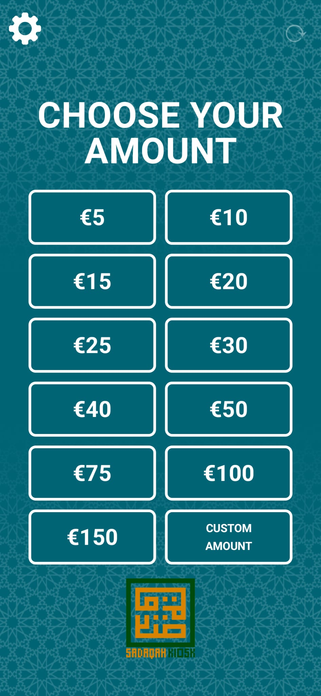
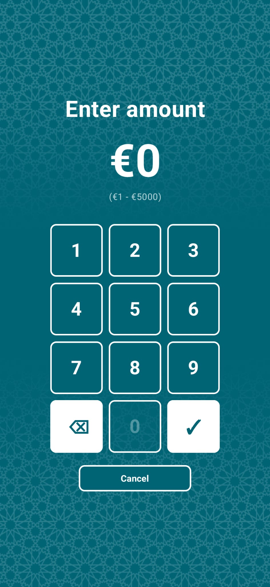
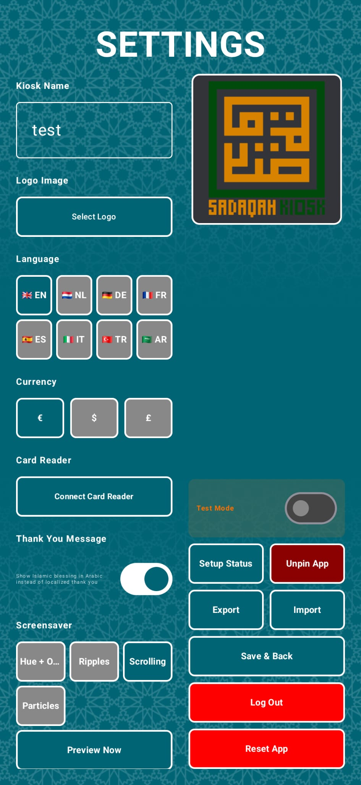

# Sadaqah Kiosk

An open-source Android donation kiosk app powered by the [SumUp](https://sumup.com) card payment SDK. Designed for mosques, Islamic charities, and community organisations to accept card donations through a self-service touchscreen terminal.

[](LICENSE.md)

---

## Screenshots

<p align="center">
  
  
  
  
  
</p>

---

## Features

- **Card payments** via SumUp card reader (chip & PIN, contactless)
  - Achieved through the SumUp Android SDK: https://github.com/sumup/sumup-android-sdk
- **Preset donation amounts** on a responsive grid
- **Custom amount** entry via on-screen numpad
- **8 languages**: English, Dutch, German, French, Spanish, Italian, Turkish, Arabic
  - Auto-detected from device locale on first launch
- **Fully themeable**: background, pattern overlay, button color, and text/border color
- **Logo upload**: display your organisation's logo on the donation screen
- **Islamic thank-you screen**: toggle between an Arabic blessing (بارك الله فيكم) and a localised "thank you"
- **Biometric / PIN gate** on the settings screen
- **Export / import settings** as JSON — configuration in the clear, secrets encrypted under a password you set at export time
- **Offline awareness**: warns when internet is unavailable; auto-dismisses SumUp login screen on disconnect and auto-reinitialises after prolonged outage
- **Auto-recovery**: automatic app restart on repeated card reader or reinit failures, with cooldown and max-restart guard to prevent loops
- **Auto-update**: device polls a GitHub releases feed, silently installs updates during nightly maintenance, and rolls back via a 60-second watchdog if the new build crashes on startup. Requires device-owner provisioning. See [Auto-Update](#auto-update) below.
- **Analytics & reporting** (optional, off by default): sends donation totals and the kiosk's own fault reports to a Supabase project you host, so a fleet can be watched from one place. Nothing is configured in the shipped app. The reports identify the kiosk that sent them. See [Analytics](#analytics) and [Privacy](#privacy).
- **Auto-start on boot**: launches automatically when the device powers on
- **Device owner / kiosk mode**: optional silent lock-task mode (no blue notification bar) when set as device owner
- **Screensaver** after configurable idle timeout
- **Auto-reinitialise** at 02:00 daily to keep the SumUp session fresh
- Responsive layout — tuned for Lenovo M9 tablet (800 dp portrait), scales to any Android device

---

## Requirements

| Requirement         | Details                                         |
|---------------------|-------------------------------------------------|
| Android             | 11.0+ (API 30)                                  |
| SumUp account       | [sumup.com](https://sumup.com) free to register |
| SumUp Affiliate Key | Generated in the SumUp developer dashboard      |
| SumUp card reader   | Air, Air Lite, Solo, or any supported reader    |
| Internet connection | Required for SumUp authentication and payments  |

---

## Building from Source

### Prerequisites

- Android Studio Hedgehog or newer
- JDK 11+
- Android SDK with API 35

### Steps

```bash
git clone https://github.com/HiIAmMoot/SadaqahKiosk.git
cd SadaqahKiosk
```

Open the project in Android Studio, or build from the command line:

```bash
# Debug build
./gradlew assembleDebug

# Release build (requires a signing keystore — see Signing below)
./gradlew assembleRelease
```

The debug APK is output to `app/build/outputs/apk/debug/`.

### Signing a Release Build

1. Generate a keystore:
   ```bash
   keytool -genkey -v -keystore kiosk.jks -keyalg RSA -keysize 2048 -validity 10000 -alias kiosk
   ```
2. Create `keystore.properties` in the project root (this file is gitignored):
   ```properties
   storeFile=../kiosk.jks
   storePassword=your_store_password
   keyAlias=kiosk
   keyPassword=your_key_password
   ```
3. Reference it in `app/build.gradle.kts` under `signingConfigs`.

---

## First-Time Setup

1. Install the APK on your Android tablet or phone.
2. Launch the app, it auto-detects your device language. 
3. Tap the **gear icon**, biometrics (fingerprint or PIN) will trigger automatically.
4. In Settings, customize the kiosk name, logo, colors, currency, and language. Tap Save & Back.
5. Log in with your SumUp Affiliate Key, you will then be prompted to log in using your SumUp account's credentials.
6. You will be prompted to connect a device.
7. After successful connection, your donors can now tap to give.

### Device Owner Setup (Optional)

Setting the app as device owner enables silent lock-task mode (no blue "app is pinned" notification) and allows programmatic Bluetooth control. The app works fine without it — this is optional for a more polished kiosk experience.

> **Important:** Device owner can only be set on a device with no accounts added, or via a fresh factory reset. You cannot set device owner on a device that already has a Google account signed in.

1. Enable **Developer Options** and **USB Debugging** on the tablet.
2. Connect the tablet to a computer with ADB installed.
3. If accounts are present, remove them or factory reset:
   ```bash
   adb shell pm list users
   ```
4. Set device owner:
   ```bash
   adb shell dpm set-device-owner com.sadaqah.kiosk/.KioskDeviceAdminReceiver
   ```
5. Verify it worked:
   ```bash
   adb shell dpm list-owners
   ```
   You should see `com.sadaqah.kiosk/.KioskDeviceAdminReceiver`.

To remove device owner later:
```bash
adb shell dpm remove-active-admin com.sadaqah.kiosk/.KioskDeviceAdminReceiver
```

### Settings Reference

| Setting                                     | Description                                                  |
|---------------------------------------------|--------------------------------------------------------------|
| Kiosk Name                                  | Appears on SumUp transaction receipts with a "SK - " prefix  |
| Logo                                        | PNG/JPEG shown on the donation screen, transparency supported |
| Language                                    | UI language; 8 options; auto-detected on first launch        |
| Currency                                    | EUR, USD, or GBP                                             |
| Background / Pattern / Button / Text colors | Full RGBA color picker with history and suggested colors     |
| Connect Card Reader                         | Pairs the SumUp reader (must be logged in first)             |
| Islamic Blessing when donating              | Toggle between Arabic بارك الله فيكم and localised "thank you" |
| Export / Import Settings                    | Back up or copy settings between devices as JSON. Secrets are encrypted under a password you choose at export time |
| Analytics & reporting                       | Off by default. Optionally reports donation totals and kiosk faults to a Supabase project you run. Identified, not anonymous — see [Analytics](#analytics) |
| Reset App                                   | Clears all stored data and restarts (double-tap to confirm)  |

### Export format

An exported file keeps configuration in plaintext so it can be inspected and
diffed, and puts secrets — currently the SumUp affiliate key — into a single
encrypted block:

```json
{
  "settings": { "kioskName": "...", "currency": "EUR" },
  "secrets": { "v": 1, "kdf": "PBKDF2WithHmacSHA256", "iterations": 600000,
               "salt": "...", "iv": "...", "ciphertext": "..." }
}
```

Encryption is AES-256-GCM with a key derived by PBKDF2-HMAC-SHA256. Deriving the
key takes a few seconds on kiosk hardware — that is intentional, and it is why
the dialog shows a progress indicator.

**The password cannot be recovered.** If it is lost, the settings in the file are
still importable via **Import settings only**, but the secrets are gone and the
affiliate key must be re-entered by hand.

Exports created by version 1.3.5 and earlier stored the affiliate key in
plaintext. Those files still import, with no password. The reverse is not
true: a new-format export imported on version 1.3.5 or earlier will apply the
settings but silently discard the secrets, since those builds don't know to
look inside the encrypted block — worth keeping in mind during a mixed-version
fleet rollout.

---

## Auto-Update

The app can update itself directly from a GitHub releases feed — no Play Store, no MDM, no operator intervention. Designed for unattended kiosks. **Requires device-owner provisioning** (see above); a non-DO install will detect updates but never install them, since silent install isn't available without that privilege.

### How it works

End-to-end:

1. **Check.** The app polls the configured GitHub repository's `/releases` API ~30 s after startup, again at 02:00 every day, and on demand when the operator opens Settings. Unauthenticated, 60 requests/hour (plenty for daily polling).
2. **Filter.** Releases must be non-draft, tagged as semver (`v1.3.0`, `1.3.5`, `1.3.5-preview`, …), and have an `.apk` asset attached. Versions below `1.3.0` (the first release with this update system) are excluded. So are versions on a different `major.minor` track than what's installed — see [The versionCode convention](#the-versioncode-convention) below. Previews are listed but never auto-installed — see [Preview releases](#preview-releases).
3. **Notify (optional).** A red dot appears next to the gear icon on the donation screen, plus a row in Settings → Updates showing `Latest: vX.Y.Z`. Hideable via the **Hide update notifications** toggle.
4. **Download (background).** During the 02:00 maintenance window, when auto-update is enabled, the target APK is fetched silently to the app's private cache. If a newer release appears mid-grace, the cached APK is discarded and the new one is fetched.
5. **Validate.** Before installing, the new APK is checked:
   - Same `packageName` as the installed app (`com.sadaqah.kiosk`)
   - Not a versionCode downgrade
   - Signing certificate fingerprint matches the installed app's (SHA-256). Mismatch rejects the install — this is the security boundary that stops a malicious mirror or wrong-keystore build from being silently installed.
6. **Install.** A backup of the currently-installed APK is copied to internal storage, then a 60-second watchdog `AlarmManager` is armed. The app unpins itself, hides any pairing UI, and commits the install via `PackageInstaller` with `USER_ACTION_NOT_REQUIRED` (silent — device-owner only).
7. **Relaunch.** The system replaces the APK and broadcasts `MY_PACKAGE_REPLACED`; a registered receiver immediately launches `MainActivity`, which writes a "fresh startup" heartbeat to disk.
8. **Watchdog.** When the AlarmManager fires (60 s after install), the watchdog reads the heartbeat. If the new build wrote one, install was successful. If it didn't — the new build crashed on startup — the watchdog reinstalls the backup APK to recover the kiosk.

### Update timing

| Setting                      | Behaviour                                                                                                                                                  |
|------------------------------|------------------------------------------------------------------------------------------------------------------------------------------------------------|
| Auto-update **on**, target **Latest** | Update detected → notification shown → after the grace period elapses, install at the next 02:00 window. Settings shows the exact scheduled install date. |
| Auto-update **on**, target **pinned** (e.g. `1.3.5`) | Install at the next 02:00 window (no grace — pinning is opt-in consent).                                                                                  |
| Auto-update **off**          | Notifications still appear; install only happens when the operator taps **Install now** in Settings.                                                       |
| **Install now** (manual)     | Operator taps the badge or the Settings button → biometric prompt → confirmation screen with the changelog → install begins immediately.                   |

Preflight gates that block any install path:
- Not device-owner
- No internet
- Battery below 30%

### Preview releases

To test a build on one or two kiosks without shipping it to every device in the field, publish it as a **preview**. A release counts as a preview if either:

- its tag carries a pre-release suffix — `v1.3.5-preview`, `v1.4.0-rc.1`, anything after a `-`; or
- it's marked **Set as a pre-release** on GitHub.

Either marker is enough, so ticking GitHub's checkbox and tagging `-preview` are both fine, together or apart.

A preview is **never** chosen automatically. It doesn't resolve as "Latest", doesn't raise the red dot next to the gear icon, and won't be installed by the 02:00 maintenance window. Kiosks left on the default settings will not see it.

To put a preview on a specific kiosk, open **Settings → Updates → Target version** and pin that kiosk to the preview (e.g. `1.3.5-preview`). Pinning is explicit consent, so the pinned kiosk installs it at the next 02:00 window with no grace period — or immediately via **Install now**.

**Preview pins expire by themselves.** A kiosk never has to be collected from preview by hand: as soon as a non-preview release *newer than the pinned preview* appears, the pin resets to **Latest** and the kiosk rejoins the fleet on the normal grace-period schedule.

The comparison is against the preview, not against the newest stable, so pinning a preview that runs ahead of the current stable still works:

| Pinned | Newest stable | What happens |
|--------|---------------|--------------|
| `1.3.5-preview` | `1.3.5` | Pin expires, kiosk targets `1.3.5` |
| `1.3.7-preview` | `1.3.6` | Pin holds — `1.3.6` is older than the preview, testing continues |
| `1.3.7-preview` | `1.4.0` | Pin expires, kiosk targets `1.4.0` |
| `1.3.7-preview` | `1.3.8-preview` | Pin holds — only a stable release expires a pin |

A pin to a stable version never expires; it stays until an operator changes it.

> **Note:** preview builds must still follow [the versionCode convention](#the-versioncode-convention) — `1.3.5-preview` shares versionCode 15 with the rest of the `1.3.x` track. A preview on a *new* minor track can't be rolled back to the old track.

> **Requires 1.3.5 or later.** Builds before `1.3.5` can't parse a pre-release tag at all — they silently ignore any release tagged `-preview`, which is safe but means those kiosks can't be pinned to one. Ship `1.3.5` to the fleet before relying on previews.

### Configuring the source repository

By default the app polls this repository (`https://github.com/HiIAmMoot/SadaqahKiosk`). If you fork and self-host releases:

1. Open **Settings → Updates → Update source (GitHub repo)**
2. Enter the full URL, e.g. `https://github.com/your-org/your-fork`
3. Tap **Apply**. The next check uses the new source.

If you're migrating from this repository to a fork signed with a different keystore, flip **Skip signature check on next install** before applying the update. The flag is single-use and clears itself after the next install attempt.

### The versionCode convention

> **Read this if you cut releases.**

Android's `PackageInstaller` refuses silent downgrades for non-platform-signed callers. That includes the watchdog rollback path. To keep the kiosk recoverable, the project uses this rule:

**All releases sharing the same `major.minor` share the same `versionCode`. Only bump `versionCode` when you cut a new minor or major — and for a new minor, only once it is stable.**

A `-preview` on a new minor track keeps the **previous** track's `versionCode`. So `1.4.0-preview` ships on 15, alongside `1.3.x`, and 16 arrives with stable `1.4.0`.

This looks like a violation of the rule above and is the point. A preview is the build most likely to crash on startup, which is the one case the watchdog exists for. Give it the new track's higher `versionCode` and rollback to the last known-good `1.3.x` becomes a silent downgrade, which Android refuses — so the watchdog cannot recover the kiosk and it needs a USB flash instead.

| Releases on the same track | versionCode | Notes                                                                                                |
|----------------------------|-------------|------------------------------------------------------------------------------------------------------|
| `1.3.0`, `1.3.1`, … `1.3.N`| 15          | Any of these can be installed over any other (Android treats them as reinstalls, not downgrades).    |
| `1.4.0-preview`            | 15          | Stays on the old track so the watchdog can still roll a broken preview back to `1.3.x`.              |
| `1.4.0`, `1.4.1`, …        | 16          | Same idea for the next minor track, from the stable cut onward.                                      |
| `2.0.0`, `2.0.1`, …        | 17          | And so on.                                                                                            |

Why it matters:
- **Watchdog rollback works** when a crashing update has the same versionCode as the backup APK. If a patch in the same minor track is broken, the watchdog can recover the kiosk autonomously.
- **Cross-track upgrades still work** (`1.3.5 → 1.4.0`) because `1.4.0` has a higher versionCode — that's a real upgrade and Android accepts it.
- **Cross-track downgrades don't work** by design. Once you ship a `1.4.0` to a device, you can't auto-roll-back to `1.3.X`. Plan minor cuts accordingly.

When this rule is followed, the target-version dropdown in Settings shows all installable patches: every release in the same `major.minor` track as the current install, plus any higher-track releases as forward upgrades. Releases on lower tracks are hidden. Previews appear in this dropdown too, so they can be pinned by hand.

### Caveats

- **No silent cross-track downgrades.** As above — `1.4.X` can't auto-revert to `1.3.X`. Recovery requires a USB flash. Pick minor versions deliberately.
- **The 02:00 maintenance window** is the only time auto-update installs unattended. If the device is off or offline at 02:00, the install is deferred to the following day.
- **Signature pinning is the security boundary.** The skip-signature toggle exists only for forking the project to a new keystore. Anything more subtle (e.g. a malicious mirror keeping the same package name but a different signing cert) is rejected by default.
- **Battery/network preflight is strict.** A device below 30% battery will keep deferring nightly until charged.
- **GitHub rate limit.** 60 unauthenticated requests/hour per IP. A single device running normal cadence is nowhere near that, but mass repeated manual checks across a fleet can run into it.

### Disabling auto-update

If you want to disable updates entirely:

1. Open **Settings → Updates**
2. Turn off **Auto-update enabled**
3. (Optional) Turn on **Hide update notifications** so the gear-icon dot doesn't surface

The app will continue to check for updates so the Settings page can show what's available, but it will never install one without an explicit operator tap.

---

## Analytics

Optional, off by default, and pointed at a database you run. A kiosk with
reporting on sends donation totals and its own fault reports to a Supabase project,
so an operator with a fleet can see which kiosk stopped taking payments without
driving to it.

Read [Privacy](#privacy) first. The reports identify the kiosk that sent them.

### Setting it up

1. Create a Supabase project. Nothing about the schema below is Supabase-specific
   beyond the API shape, but the app speaks PostgREST and expects Supabase's
   header conventions.
2. Run the SQL below in the project's SQL editor.
3. On the kiosk, open **Settings → Analytics & reporting**, enter the project URL
   and the **publishable** key. Not the service-role key: that one grants full
   read and write on the database, and it would be sitting on a tablet in a public
   room. The screen warns if the key does not start with `sb_publishable_`.
4. Set the kiosk code, the privacy policy URL and the terms URL.
5. Turn on **Send analytics**, then press **Test connection**. A successful test
   writes one activation row and is what starts reporting.

The URL must be `https`. The app rejects `http`, a URL carrying a username or
password, and a URL with a query string or fragment, all at entry rather than at
first flush. Credentials are stored encrypted under a hardware-backed
AndroidKeyStore key.

### When a kiosk sends

Uploads are batched and infrequent, and they never happen during a donation. A
flush runs when the screensaver appears, every 30 minutes while the screensaver is
up, at 02:00 during the nightly maintenance window, when the network comes back
after an outage, and when an operator presses **Test connection**.

An offline kiosk queues to a local file and keeps queuing. That queue holds 5,000
events and retires anything older than 30 days; when it has to shed rows, donation
rows are evicted last. A failing destination backs off per table, starting at one
minute and doubling to a one-hour ceiling, so one table the database refuses does
not hold up a table it accepts.

### Reference schema

Paste this into a new Supabase project. It is the same shape the app's own backend
uses; a vendor backend adds its own tables on top of this base rather than changing
it.

```sql
-- Tables ------------------------------------------------------------------

create table donation_events (
  id           uuid primary key,
  code         text not null default '',
  install_id   text not null,
  app_version  text not null,
  amount_cents integer not null,
  currency     text not null,
  occurred_at  timestamptz not null
);

create table diagnostic_events (
  id          uuid primary key,
  code        text not null default '',
  install_id  text not null,
  app_version text not null,
  occurred_at timestamptz not null,
  kind        text not null,
  severity    text not null,
  detail      jsonb,
  stack_trace text
);

create table telemetry_activations (
  id                 uuid primary key,
  code               text not null default '',
  install_id         text not null,
  app_version        text not null,
  activated_at       timestamptz not null,
  privacy_policy_url text not null,
  terms_url          text not null
);

-- Row-level security -------------------------------------------------------
-- Insert only. No select, update or delete policy exists, so none is allowed.

alter table donation_events       enable row level security;
alter table diagnostic_events     enable row level security;
alter table telemetry_activations enable row level security;

create policy kiosk_insert on donation_events
  for insert to anon with check (true);
create policy kiosk_insert on diagnostic_events
  for insert to anon with check (true);
create policy kiosk_insert on telemetry_activations
  for insert to anon with check (true);

-- Grants -------------------------------------------------------------------
-- Supabase grants the anon role full table privileges in the public schema by
-- default. Take them back before granting insert, or the only thing standing
-- between a leaked key and every donation row is the RLS policy set above.

revoke all on donation_events       from anon, authenticated;
revoke all on diagnostic_events     from anon, authenticated;
revoke all on telemetry_activations from anon, authenticated;

grant insert on donation_events       to anon;
grant insert on diagnostic_events     to anon;
grant insert on telemetry_activations to anon;
```

### Rules you must not undo

Each of these is a decision the app already depends on. Getting one wrong does not
produce an error that explains itself.

**Grant INSERT. Never grant SELECT.** The same publishable key ships on every
kiosk in a fleet, on tablets standing in public rooms, and it is therefore assumed
leaked. What makes a leaked key worthless is that it cannot read anything back.
Grant SELECT out of habit and a key printed into every kiosk you own becomes a key
that reads every donation you have ever taken.

The app is built on this, not merely advised by it. Inserts send
`Prefer: return=minimal` and deliberately never `resolution=ignore-duplicates` or
`return=representation`. Both of those push PostgREST onto its upsert path, which
requires SELECT on the target table, and both return 401 against a key that does
not have it.

Two separate mechanisms enforce the rule above, and both are in the SQL for a
reason. Row-level security with no SELECT policy blocks reads even if the grant is
present. Revoking the grant means that a policy someone adds later, in a hurry,
does not immediately expose the whole table. Keep both.

**Leave `kind` unconstrained.** It is plain text and must stay plain text. The list
of kinds grows with each release, and a `CHECK` constraint or an enum type that
rejects a new one does not fail quietly: the insert is refused, the kiosk treats a
400 as a bad row, the outbox stalls behind it, and the queue's 5,000-event cap
eventually starts dropping real donation rows to make room. The list below is
documentation for whoever writes the queries, not a constraint.

**No regex `CHECK` on `code`.** The app validates the kiosk code advisorily and
never blocks on it, because a fork of this app has no code scheme and never will. A
database constraint would reject exactly what the app deliberately accepts, with
the same failure mode as constraining `kind`. Validate on read, never at insert.

**Keep `install_id` as `text`, not `uuid`.** The app mints a UUID on first run, so
the values are UUIDs in practice. Typing the column as `uuid` means a kiosk that
somehow sends an empty string is refused with a 400, which the app reads as a
permanently bad row. Text costs nothing and cannot turn an identity bug into
deleted donation rows.

**Keep `id` as the primary key.** That is what makes retries safe. The client
generates every `id`, so a retry after an ambiguous network failure collides on the
key rather than inserting a second copy of the same donation. Drop the key and an
interrupted upload counts a donation twice.

The app reads the collision from the `23505` SQLSTATE in PostgREST's error body,
not from the 409 status alone, because PostgREST maps the whole integrity-violation
family onto 409 and some of those mean the row was never stored. If you put
PostgREST behind a proxy that strips or rewrites error bodies, the app cannot tell
an absorbed retry from a failure, and the row retries until the 30-day cap retires
it.

**Expect more than one activation row per kiosk.** A re-provisioned unit gets a new
install ID and activates again. Nothing may assume uniqueness on `code`.

`occurred_at` is the device's own clock. A kiosk that was offline for days with a
drifted RTC reports confidently wrong times. Adding `received_at timestamptz
default now()` on your side is the cheapest way to see the skew.

### Diagnostic kinds

Eleven kinds, with a fixed severity each. Reference for query authors, not a
constraint.

| Kind | Severity | Emitted when | `detail` |
|---|---|---|---|
| `crash` | error | An uncaught exception reaches the handler | `thread`, `main` |
| `restart_triggered` | error | Repeated failures crossed the auto-restart threshold | `reason`, `outcome` (`restarted` or `gave_up`) |
| `sumup_reinit_failed` | error | SumUp login failed after a reinitialise | `code`, `message`, `closed_by` |
| `card_reader_connect_failed` | warn | The reader page returned without a connection | `code`, `message`, `closed_by` |
| `card_reader_page_timeout` | warn | The pairing page was still open when the timeout fired | `closed_by` |
| `checkout_no_reader` | warn | A checkout failed with no reader connected | `code`, `message` |
| `bluetooth_watchdog_fired` | warn | The watchdog switched Bluetooth back on | `off_ms` |
| `network_outage` | warn | An outage exceeded the configured threshold | `downtime_ms`, `threshold_ms` |
| `update_installed` | info | A new build's first run after replacement | `from`, `to` |
| `update_install_failed` | error | `PackageInstaller` returned a failure | `reason` |
| `update_rollback` | error | The watchdog restored the backup APK | `outcome`, `from_version` |

`message` carries the SumUp SDK's own error text, redacted and length-bounded.
`closed_by` is present only when the app itself closed the SumUp page, for example
a screensaver or a pairing timeout; its absence is what marks a genuine
operator-facing failure. `detail` and `stack_trace` are absent rather than null
when a kind has nothing to put in them.

---

## Architecture

```
app/src/main/java/com/sadaqah/kiosk/
├── MainActivity.kt              # Activity, SumUp API integration, state management
├── Translations.kt              # Language enum, TranslationManager, all 8 Strings objects
├── ColorHistory.kt              # Recently picked and suggested colors singleton
├── LogoColorExtractor.kt        # Palette-based dominant colours from the logo, for the picker
├── Utils.kt                     # responsiveDp / responsiveSp helpers, grid column logic
├── BootReceiver.kt              # Launches app on BOOT_COMPLETED
├── KioskDeviceAdminReceiver.kt  # Device admin receiver for silent lock-task mode
├── model/
│   └── Settings.kt              # Data class for all persisted settings
├── recovery/
│   ├── KeyValueStore.kt         # SharedPreferences abstraction (testable)
│   ├── RestartManager.kt        # Auto-restart decision logic with guards
│   └── NetworkRecoveryManager.kt # Network outage detection and recovery
├── donations/
│   ├── DonationHistory.kt       # Append-only JSON-lines log, sharded by calendar year
│   ├── DonationStats.kt         # Pure timeframe / throughput-average calculations
│   └── DonationCsvExporter.kt   # Writes the full history to public Downloads as CSV
├── update/
│   ├── UpdateManager.kt              # Orchestrator: check, download, validate, install, schedule
│   ├── UpdateTypes.kt                # SemVer, ReleaseInfo, UpdateState
│   ├── GitHubReleasesClient.kt       # Unauthenticated GitHub releases REST client
│   ├── ApkDownloader.kt              # APK download to app-private cache, cleanup
│   ├── ApkValidator.kt               # packageName + versionCode + signing-cert checks
│   ├── ApkInstaller.kt               # Silent install via PackageInstaller (device-owner)
│   ├── BackupStore.kt                # Saves the current APK before each install
│   ├── UpdateWatchdogReceiver.kt     # 60 s alarm + rollback if no heartbeat
│   └── PackageReplacedReceiver.kt    # Relaunches the app after self-update
├── screens/
│   ├── DonationScreen.kt        # Main donation grid
│   ├── CustomAmountScreen.kt
│   ├── SettingsScreen.kt
│   ├── SetupStatusScreen.kt     # Network/Bluetooth/reader status checklist
│   ├── DonationHistoryScreen.kt # Donation totals, averages, CSV export
│   ├── ColorPickerScreen.kt
│   ├── LoginScreen.kt
│   ├── ScreensaverScreen.kt
│   ├── ThankYouScreen.kt
│   ├── NoInternetScreen.kt      # Offline overlay with a route into Settings
│   ├── MaintenanceScreen.kt
│   ├── UpdateAvailableConfirmScreen.kt  # Changelog + confirm before a manual install
│   └── UpdatingScreen.kt        # Progress overlay while an update installs
├── components/
│   ├── NumpadButton.kt
│   └── ColorComponents.kt
└── ui/theme/
    ├── Theme.kt                 # Static light scheme — dark/dynamic colour never applies
    ├── Type.kt                  # Bundled Inter / Noto Naskh Arabic, picked per language
    └── Color.kt
```

Settings are persisted to `SharedPreferences` as JSON (Gson). Donation history lives in app-private internal storage as year-sharded JSON-lines files. The SumUp SDK handles all payment processing; this app never touches card data.

### SumUp SDK version

The project is **deliberately pinned to merchant-sdk 5.0.4**. Newer versions (6.x, 7.x) crash the app during the reinitialise cycle the kiosk runs at 02:00 and after a network outage, which makes them unusable for unattended operation. The pin will be revisited once a release after 7.1.0 ships with that fixed.

---

## Contributing

Contributions are welcome! Please read the guidelines below before opening a PR.

### Reporting Bugs

Use the [Bug Report](.github/ISSUE_TEMPLATE/bug_report.md) template. Include:
- Device model and Android version
- Steps to reproduce
- What you expected vs. what happened
- Logs if available (`adb logcat -s SumUpPayment SumUpLogin NetworkStatus`)

For bugs specifically related to the SumUp SDK, please refer to their github issues page: https://github.com/sumup/sumup-android-sdk/issues

### Suggesting Features

Use the [Feature Request](.github/ISSUE_TEMPLATE/feature_request.md) template.

### Submitting Code

1. Fork the repository and create a branch from `master`:
   ```bash
   git checkout -b feature/my-feature
   ```
2. Make your changes. Keep PRs focused — one feature or fix per PR.
3. Follow the existing code style (Kotlin, Jetpack Compose, Material3).
4. Test on at least one real device (emulator alone is insufficient for SumUp SDK testing).
5. Open a Pull Request using the [PR template](.github/pull_request_template.md).

### Adding a Language

1. Add a new entry to the `Language` enum in `Translations.kt` with the BCP 47 language code, display name, flag emoji, and short code.
2. Implement the `Strings` interface for the new language (copy `EnglishStrings` and translate all fields).
3. Add the new case to `TranslationManager.currentStrings()` and `rememberStrings()`.

### Code Style

- Self-documenting names over comments
- Comments only for non-obvious *why*, never for *what*
- No commented-out code
- Keep Composables small and single-purpose
- No hardcoded colors in screens — always use `settings.buttonColor` / `settings.buttonBorderColor` etc.

---

## Support the Project

If this app has been useful to your masjid or organisation, consider supporting its development.

| Method         | Address / Link                                                 |
|----------------|----------------------------------------------------------------|
| Ko-fi          | [ko-fi.com/iammoot](https://ko-fi.com/iammoot)                 |
| thanks.dev     | [thanks.dev/d/gh/hiiammoot](https://thanks.dev/d/gh/hiiammoot) |
| Bitcoin (BTC)  | `bc1qprtakahp8xtt6tltjacx88wvnp4hgcxlk7kmhe`                   |
| Ethereum (ETH) | `0x6B652e4955b82Fb40eF9f503D30dBBf28c09573a`                   |
| Solana (SOL)   | `CDiKy33RzxpFFXxzxKN89MpfAmCYsZhSN2a2UV5bErqz`                 |

---

## Privacy

**The app as shipped has no reporting destination configured and sends nothing
anywhere.** There is no endpoint compiled into the build, no default URL, and no
key. A kiosk you install and never configure transmits nothing beyond what the
SumUp SDK does for payment processing. See
[SumUp's privacy policy](https://sumup.com/privacy/) for that half.

Reporting is an optional feature an operator switches on. It is off until someone
opens Settings, enters a Supabase project URL and publishable key, turns on **Send
analytics**, and presses **Test connection**. Until that test succeeds the kiosk
sends nothing, and the destination is a database you run. Nothing reaches this
project's authors.

### The reports identify the kiosk

This is the part worth reading twice. The data is **identified, not anonymous**.

Every row carries the kiosk's install ID (a random UUID minted on the device at
first run) and the kiosk code an operator typed at provisioning. The code is free
text, and the convention this project's own deployments follow encodes a country, a
region, a city and an organisation slug, for example
`nl-gld-arnhem-nour_al_houda-01`. A kiosk using that convention is identifiable
from any single row, without joining anything.

You can leave the code blank. The install ID is still sent, and it still ties every
row from one tablet together.

### What is sent

Three tables, each row carrying `id`, `code`, `install_id` and `app_version` before
its own fields.

Donation events, one per completed payment:

| Field | Contents |
|---|---|
| `amount_cents` | Amount as an integer number of minor units, never a float |
| `currency` | `EUR`, `USD` or `GBP` |
| `occurred_at` | The device clock at the moment of payment |

Diagnostic events, one per fault the kiosk notices about itself:

| Field | Contents |
|---|---|
| `occurred_at` | Device clock |
| `kind` | One of eleven fault kinds, listed under [Analytics](#analytics) |
| `severity` | `info`, `warn` or `error`, fixed per kind |
| `detail` | A small JSON object whose shape depends on the kind |
| `stack_trace` | Crash reports only, redacted and capped at 8 KB |

Activation records, written when **Test connection** first succeeds:

| Field | Contents |
|---|---|
| `activated_at` | Device clock |
| `privacy_policy_url` | The URL configured in Settings, as shown on the kiosk's disclosure screen |
| `terms_url` | Same, for terms |

The `detail` object is structured, not free text. It carries thread names, restart
reasons, downtime in milliseconds, version strings, SumUp result codes, and on some
kinds the SumUp SDK's own error message. The full per-kind list is in the
[Analytics](#analytics) section.

### What is never sent

No donor identity of any kind. Nothing in the app reads one, and no field exists to
carry it.

No card data. The SumUp SDK handles the card end to end and the app never touches
it.

No uploaded logo, no background image, no theme configuration, and nothing else
from the Settings screen. The app version, the kiosk code and the install ID are
the only configured values that leave the device.

No donation history file, no CSV, and no per-donation record beyond the amount,
currency and timestamp above. The local donation history screen is separate and
stays on the device.

### Crash reports

A crash report carries the exception's stack trace. It is redacted before it is
written to disk, not before it is sent, because the queue file survives a crash and
could be pulled off a device.

Redaction does two things and no more:

- It removes the SumUp affiliate key wherever it appears, matched exactly and
  case-insensitively.
- It replaces any unbroken run of 32 or more characters drawn from
  `A-Z a-z 0-9 + = _ -` with `[redacted]`.

That is the whole of it. The 32-character floor is deliberate: at a lower
threshold the redactor destroys ordinary class names in every stack trace and the
report stops being useful. The consequence is that shorter secrets are not caught,
and a value containing `/` is measured in the runs between the slashes rather than
as a whole. Package names, file paths, line numbers, thread names and exception
messages all survive by design, because they are the reason the trace was collected.

The trace is then truncated to 8 KB.

### SumUp transaction identifiers

The app never reads a SumUp transaction code. No field carries one and nothing in
this repository constructs an event containing one.

We stop short of saying it can never appear. Three diagnostic kinds forward the
SumUp SDK's own error message into `detail` after redaction, and the redactor's
floor is 32 characters, above the length of a SumUp transaction code. The SDK is a
pinned closed binary, so nothing in this repository can show what strings it puts
in an error message. If it ever embeds a transaction code in one, that code would
reach the diagnostics table.

This is recorded as inferred rather than demonstrated in
[docs/known-debt.md](docs/known-debt.md), along with what would settle it.

### Turning it off

Switching **Send analytics** off stops collection at the source. No donation row
and no diagnostic row is written to disk, not even to be held back. The one
exception is a local marker: a fault serious enough to restart the app, and a
failed update that the watchdog rolled back, are noted in the device's own
preferences whatever the analytics setting says. That marker is read and cleared at
the next startup, and it becomes a diagnostic event only if analytics is on by
then.

Switching off does not delete what was already queued. Rows collected earlier stay
in the outbox file and stop being sent; turning analytics back on later sends them.
**Clear credentials** on the Analytics screen removes the destination, deletes the
queue outright, and resets the status counters.

### The on-device disclosure

Saving a reporting destination shows a full-screen summary on the kiosk itself,
covering what is sent, that the reports identify the kiosk, what is never sent, and
where it goes. It renders the configured privacy policy and terms URLs as QR codes,
because a kiosk in lock-task mode cannot open a browser. It can be reopened from
Settings at any time. The screen is not shown when no privacy policy URL is
configured, since there would be nothing honest to point at.

### Known gaps

Nothing currently prevents a kiosk from reporting with no privacy policy URL
configured. The settings screen warns, but the flush is not gated on it. That and
the SumUp identifier question above are both recorded in
[docs/known-debt.md](docs/known-debt.md).

---

## License

[GNU Affero General Public License v3.0](LICENSE.md) — see the file for full terms.

In short: you may use, modify, and distribute this software freely, but any derivative work must also be released under AGPL v3 with source code available — including if you run a modified version as a hosted or network service.
